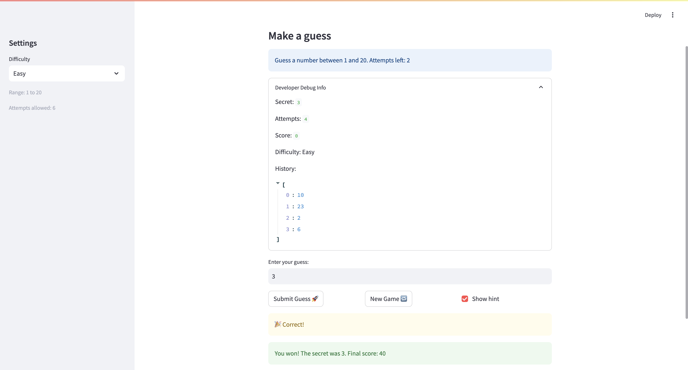

# 🎮 Game Glitch Investigator: The Impossible Guesser

## 🚨 The Situation

You asked an AI to build a simple "Number Guessing Game" using Streamlit.
It wrote the code, ran away, and now the game is unplayable. 

- You can't win.
- The hints lie to you.
- The secret number seems to have commitment issues.

## 🛠️ Setup

1. Install dependencies: `pip install -r requirements.txt`
2. Run the broken app: `python -m streamlit run app.py`

## 🕵️‍♂️ Your Mission

1. **Play the game.** Open the "Developer Debug Info" tab in the app to see the secret number. Try to win.
2. **Find the State Bug.** Why does the secret number change every time you click "Submit"? Ask ChatGPT: *"How do I keep a variable from resetting in Streamlit when I click a button?"*
3. **Fix the Logic.** The hints ("Higher/Lower") are wrong. Fix them.
4. **Refactor & Test.** - Move the logic into `logic_utils.py`.
   - Run `pytest` in your terminal.
   - Keep fixing until all tests pass!

## 📝 Document Your Experience

- [x] Describe the game's purpose.
   The purpose of this project is to debug and stabilize an AI-generated Streamlit number guessing game so that gameplay is consistent, hints are trustworthy, and the app logic can be tested outside the UI.

- [x] Detail which bugs you found.
   I found a hint-direction bug where feedback did not consistently match the guess (for example, high guesses could still lead to confusing guidance). I also identified state issues around gameplay flow, especially when difficulty changed mid-game, which required a full reset of attempts, score, status, history, and secret number. In early debugging, input handling suggestions that accepted non-integer guess paths caused errors and needed to be corrected.

- [x] Explain what fixes you applied.
   I refactored core logic into `logic_utils.py` and used `check_guess` to ensure outcomes and messages are aligned (`Too High` -> `Go LOWER`, `Too Low` -> `Go HIGHER`). I added state-reset handling in `app.py` through `reset_game_state(...)` and triggered it when difficulty changes or when starting a new game, so the secret remains stable during a round and resets intentionally between rounds. I kept parsing and scoring centralized with `parse_guess` and `update_score`, then verified behavior with `pytest`, including regression coverage for hint direction.

## 📸 Demo

- [x] [Insert a screenshot of your fixed, winning game here]
   
## 🚀 Stretch Features

- [ ] [If you choose to complete Challenge 4, insert a screenshot of your Enhanced Game UI here]
